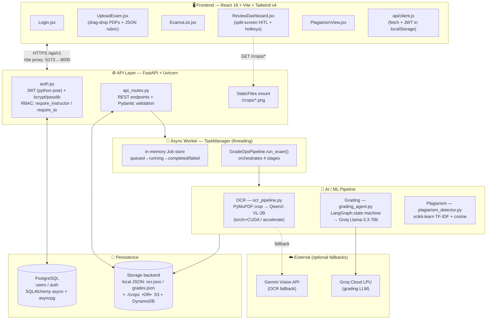
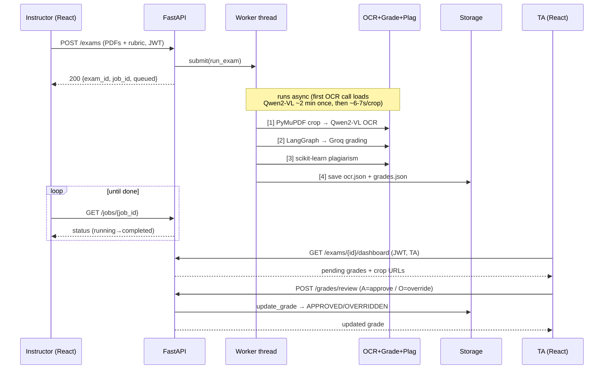

# GradeOps — Answer-Sheet Lifecycle & Architecture

End-to-end journey of a scanned answer sheet, from upload to verified grade,
with the component and technology used at every step. Diagrams are Mermaid
(render automatically on GitHub).

---

## 1. System overview (layers & tech)



---

## 2. The answer-sheet lifecycle (upload → verified)

```mermaid
flowchart TD
    A0["👤 Instructor logs in<br/><i>Login.jsx → POST /api/v1/auth/login</i><br/>form-urlencoded; bcrypt verify; JWT returned"] --> A1

    A1["📤 Upload bulk PDFs + JSON rubric<br/><i>UploadExam.jsx → FormData → POST /api/v1/exams</i><br/>multipart; Bearer JWT; require_instructor"] --> A2

    A2["🆔 submit_exam()<br/>save PDFs to tempdir • parse rubric →<br/>ExamBatch (Pydantic) • exam_id = uuid4"] --> A3

    A3["🧵 TaskManager.submit() → background thread<br/><b>returns instantly</b>: {exam_id, job_id, status: queued}"] --> POLL & B1

    POLL["🔄 Frontend polls<br/>GET /api/v1/jobs/{job_id}<br/>queued → running → completed"]

    subgraph BG["GradeOpsPipeline.run_exam() — runs in worker thread"]
        direction TB
        B1["[1/4] 📄 OCR<br/>PyMuPDF renders PDF→images @200 DPI<br/>_extract_question_crop (auto-split / regions)<br/>save crop PNG → ./crops"] --> B2

        B2["🔤 Transcribe each crop<br/><b>Qwen2-VL-2B</b> on GPU (device_map=auto)<br/>→ raw_text + confidence<br/>→ OCRResult → save_ocr_bulk (ocr.json)"] --> B3

        B3["[2/4] 🧠 Grade — LangGraph loop<br/>per criterion: LLM (Groq Llama-3.3-70b)<br/>→ {awarded, justification}; partial credit<br/>→ aggregate → GradeResult (status=AI_GRADED)"] --> B4

        B4["[3/4] 🕵️ Plagiarism<br/>scikit-learn TF-IDF + cosine across answers<br/>pairs ≥ 0.82 → mark grade FLAGGED"] --> B5

        B5["[4/4] 💾 Persist grades<br/>save_grades_bulk → grades.json<br/>job → completed"]
    end

    B5 --> C1

    C1["👤 TA logs in → opens review<br/><i>ReviewDashboard.jsx → GET /exams/{id}/dashboard</i><br/>returns pending (AI_GRADED/FLAGGED) + crop URLs"] --> C2

    C2["👀 Split-screen verify (HITL)<br/>cropped image (/crops/*) ‖ transcription + score + justification<br/>plagiarism bar if flagged"] --> C3

    C3{"⌨️ TA decision<br/>(keyboard shortcuts)"}
    C3 -->|"A = approve"| C4A["POST /grades/review<br/>status → APPROVED"]
    C3 -->|"O = override score"| C4B["POST /grades/review<br/>status → OVERRIDDEN + ta note"]
    C3 -->|"↑/↓ navigate"| C2

    C4A --> D1
    C4B --> D1

    D1["💾 apply_ta_review() → update_grade()<br/>persisted to grades.json"] --> D2
    D2["📊 Instructor: ExamsList + CSV export<br/>GET /exams/{id}/grades/export (csv module)"]
```



---

## 3. Step-by-step: component + technology at each step

| # | Step | Frontend | Backend / Endpoint | Technology |
|---|------|----------|--------------------|------------|
| 1 | **Login** | `Login.jsx`, `AuthContext` | `POST /api/v1/auth/login` | JWT (python-jose), bcrypt+passlib, PostgreSQL (SQLAlchemy async / asyncpg) |
| 2 | **Upload sheets + rubric** | `UploadExam.jsx` (drag-drop, `FormData`) | `POST /api/v1/exams` (`require_instructor`) | FastAPI `UploadFile` + python-multipart; Pydantic `ExamBatch`/`Rubric` |
| 3 | **Queue job** | — (gets `job_id`) | `TaskManager.submit()` | Python `threading`, in-memory Job store, `uuid4` |
| 4 | **PDF → crops** | — | `OCRPipeline.process_exam_pdf` | **PyMuPDF (fitz)** @200 DPI, Pillow, auto-split/regions → PNG in `./crops` |
| 5 | **Transcribe handwriting** | — | `_QwenVLBackend.transcribe` | **Qwen2-VL-2B** (transformers, torch+CUDA cu130, accelerate `device_map=auto`); fallbacks: Gemini Vision / Nougat / mock |
| 6 | **Store OCR** | — | `storage.save_ocr_bulk` | local `ocr.json` (+ crops on disk) **or** S3 + DynamoDB (boto3) |
| 7 | **Grade vs rubric** | — | `GradingAgent.grade_batch` | **LangGraph** state machine (grade_criterion → aggregate), **LangChain + Groq** Llama-3.3-70b; partial credit + JSON justifications |
| 8 | **Plagiarism scan** | — | `PlagiarismDetector.full_report` | **scikit-learn** TF-IDF + cosine similarity; threshold 0.82 (sentence-transformers optional) |
| 9 | **Persist grades** | — | `storage.save_grades_bulk` | local `grades.json` **or** DynamoDB |
| 10 | **Poll status** | `client.getJob()` | `GET /api/v1/jobs/{job_id}` | polling; status enum queued→running→completed |
| 11 | **TA review feed** | `ReviewDashboard.jsx` | `GET /api/v1/exams/{id}/dashboard` | returns pending grades + `/crops/*` URLs (`require_ta_or_above`) |
| 12 | **View crop side-by-side** | `` | FastAPI `StaticFiles` mount `/crops` | static file serving |
| 13 | **Approve / Override** | hotkeys `A`/`O`/`↑↓` | `POST /api/v1/grades/review` | `apply_ta_review` → status APPROVED / OVERRIDDEN |
| 14 | **Export** | `ExamsList.jsx` | `GET /api/v1/exams/{id}/grades/export` | Python `csv` → CSV download |

---

## 4. HITL request/response timing (sequence)



---

## 5. Key design notes

- **Non-blocking upload:** `POST /exams` returns a `job_id` immediately; heavy
  OCR/grading runs in a background thread (`TaskManager`). Production target:
  swap for **Celery + Redis** (noted in `background_tasks.py`).
- **Model residency:** the OCR pipeline is a lazy singleton (`get_pipeline()`),
  so Qwen2-VL loads **once** into VRAM on the first OCR request, then stays warm.
- **Pluggable backends:** OCR (`qwen_vl`/`gemini`/`nougat`/`mock`), LLM
  (`groq`/`gemini`/`openai`/`anthropic`/`together`), and storage (`local`/`s3`)
  are all swappable via `.env` with no code change.
- **RBAC boundary:** instructors upload/export; TAs review/verify — enforced by
  FastAPI dependencies (`require_instructor`, `require_ta_or_above`).
```
